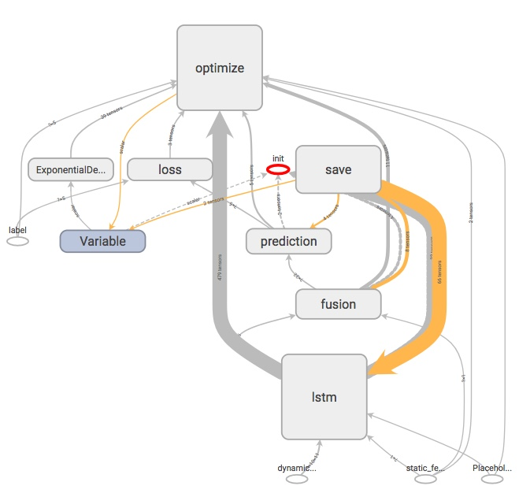
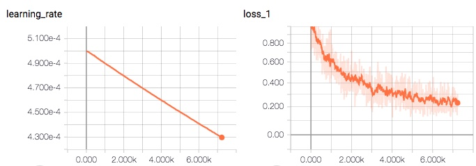

# A modelling experiment for Crop data

## Some input information from Caicai (CN)
1. sensors_data是传感器收集的环境数据，作为输入数据。ck_data是对照组的植物生理数据，tr_data是实验组的植物生理数据。植物生理数据作为监督学习的结果数据。

2. 目的是建立两套模型(一种是对照组的不添加指定药剂的模型，另一种是实验组的模型），通过一定时间的环境数据收集，可以推测出植物生理指标变化趋势。
   * Lele: 对照组设case = 1,  实验组设case = 0。refer to logs/data_label.txt
   * Lele: As a result, only one model needs to be trained. The case number is served as one of the static input which will be fused with LSTM output.

3. 因为数据量太少，应该需要data augmentation。
   * Lele: random sampling from different time during the day at training time, since the time slice follows daily aggregations.
   * Gaussian noise is added at training time to increase robustness.
   * Missing data is imputed with the closest neighbour.
   * day of the month and month of the year is used as a part of the feature.
   * due to the above simple approaches, the augmented dataset is combinatoriality large yet the input feature/label space is still biased towards the limited dataset. 

## Modelling functions implemented

- [x] data laundry and pre-processing.
- [x] data augmentation.
- [x] training.
- [x] saving snapshot and log files.
- [x] exporting model.
- [ ] prediction script.

## Training Instructions

Prerequisite: tensorflow 1.4+
```
pip install --upgrade tensorflow
```

Start training a new model:
```
python train.py
```
Note that the log will be saved in logs/training.log and the snapshots/model will be saved under folder dump/

Tensorboard:
```
tensorboard --logdir dump
```
Then visit http://localhost:6006/

### Trained model
The model (training) looks like below (Multivariate Regression: LSTM with BN + DNN):


The saved model (under folder dump/0) is trained with 100000 iterations with batch size 16 and learning rate 0.0005 (with decay); its trend of learning rate and loss looks like the following during the entire training procedure:



## Prediction Instructions
Can be done upon request